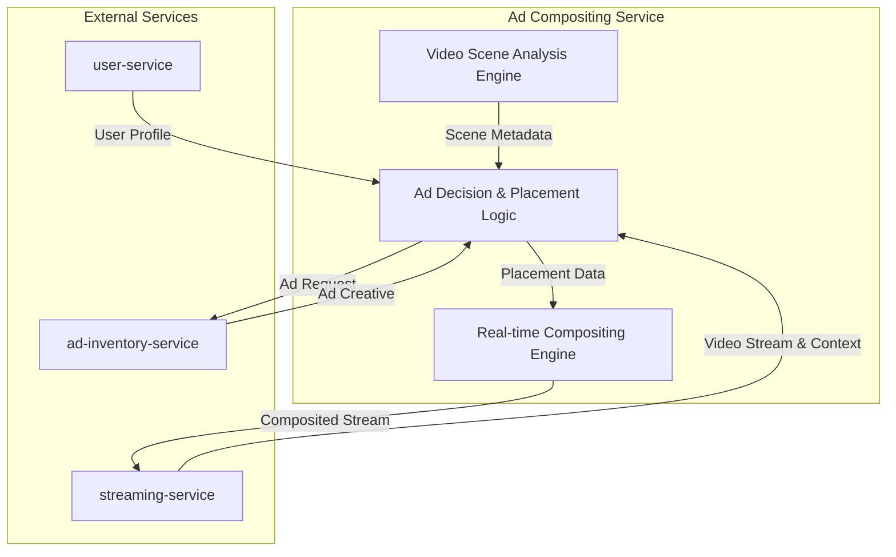

# Ad Compositing Service - Technical Design

This document outlines the high-level technical design for the in-house, AI-powered Ad Compositing service.

---

### Guiding Principles

1.  **Full Ownership:** We will own the core IP and technology stack. No external composition APIs.
2.  **Real-time Performance:** The compositing process must not introduce user-perceptible latency.
3.  **Context-Aware:** Ad placement must be intelligent, respecting the underlying video content.
4.  **Scalability:** The architecture must scale to handle millions of concurrent streams.

---

### High-Level Architecture

The service will be composed of three main internal components and will interact with other platform services.

### Component Breakdown

**1. Video Scene Analysis Engine (VSAE)**
*   **Technology:** Python, OpenCV, and a custom-trained PyTorch model.
*   **Function:**
    *   For VOD: Asynchronously analyzes video files upon ingest. It uses a CNN to detect potential surfaces (e.g., walls, screens, tables) and objects. It stores this data (timecodes, coordinates, surface normals) in a dedicated metadata store (ScyllaDB).
    *   For Live: Performs a lightweight, real-time analysis on I-frames to identify high-value placement opportunities in the stream.
*   **Output:** A structured data format (JSON) describing potential ad placements within a given video time range.

**2. Ad Decision & Placement Logic (ADPL)**
*   **Technology:** Go, chosen for its high concurrency and performance.
*   **Function:**
    *   The main entry point for the service. It receives the request from the `streaming-service`.
    *   Fetches VSAE metadata for the given video.
    *   Fetches the user's profile from the `user-service` to understand their interests and subscription tier.
    *   Queries the `ad-inventory-service` with targeting parameters (content context, user demographics).
    *   Selects the best ad and the best placement from the available options, applying business rules (e.g., frequency capping, no ads on sensitive content).
*   **Output:** Instructions for the compositing engine, including the ad creative URL and the precise transformation matrix (position, scale, rotation) for the overlay.

**3. Real-time Compositing Engine (RCE)**
*   **Technology:** C++, GStreamer, and a custom GStreamer plugin for the overlay logic.
*   **Function:**
    *   Operates as a highly-optimized video pipeline.
    *   Receives the raw video frames from the `streaming-service` (or directly from the source).
    *   Based on the instructions from the ADPL, it fetches the ad creative (image or short video).
    *   Uses the custom GStreamer plugin to perform the compositing. This involves applying the transformation matrix to the ad creative and alpha-blending it onto the source video frame.
    *   The composited frames are then streamed back to the `streaming-service` for packaging and delivery to the user.
*   **Performance:** The target for this process is sub-frame latency (<16ms) to ensure a seamless viewing experience.

---

### Data Flow for a VOD Ad Placement

1.  A user starts watching a video.
2.  The `streaming-service` sends a request to the Ad Compositing Service, including `video_id` and `user_id`.
3.  The ADPL fetches the scene analysis data for `video_id` from the VSAE metadata store.
4.  The ADPL fetches the user's profile from the `user-service`.
5.  The ADPL determines an ad should be placed at the current timestamp. It requests a suitable ad from the `ad-inventory-service`.
6.  The ADPL sends the raw video segment, ad creative, and a precise transformation matrix to the RCE.
7.  The RCE composites the ad onto the video frames.
8.  The RCE returns the composited video segment to the `streaming-service`.
9.  The `streaming-service` sends the final stream to the client.

---

### Next Steps

1.  Develop a prototype of the VSAE using OpenCV and a pre-trained object detection model.
2.  Build the core ADPL logic in Go, mocking the service dependencies.
3.  Create a basic GStreamer pipeline in C++ for the RCE.
4.  Integrate the components and begin end-to-end testing.
